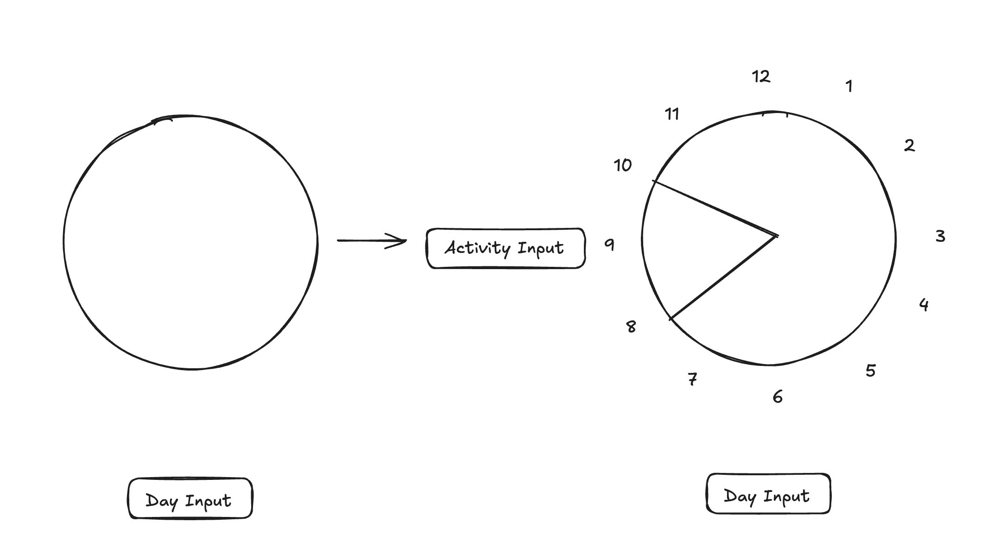

# Day Organization Planner

**Live site:** https://day-organization-planner.vercel.app/

A frontend-only web app for visually planning a day on a circular clock face.
Drag out time segments, label each one with what's planned, and see the whole
day at a glance. Built with React + TypeScript (Vite), no backend.

Most useful for weekends, but works for any day.

## How it works

The day is split into two clock dials:

- **Day dial** — 7:00 AM to 6:00 PM
- **Night dial** — 6:00 PM to 12:00 AM

To plan a segment, click and drag across the dial between the start and end
hour you want; the dial snaps to whole hours and shows a live preview of the
range as you drag. On release, a small popup opens next to where you let go
asking what's planned for that block.

Each segment is filled with a random pastel color, with its label rendered in
a darker shade of the same hue so it stays readable against the fill. Segment
labels are shown directly on the dial.

Click an existing segment to reopen its popup, where you can edit the label
or delete the segment entirely.

A **"View all tasks"** button opens a modal listing every segment for the day
in chronological order, independent of which dial it's on.

A **"Download image"** button exports a snapshot of just the two dials as a
PNG file, named `day-planner-YYYY-MM-DD.png`.

## Stack

- React 19 + TypeScript
- Vite (dev server / build)
- Vitest + Testing Library (unit/component tests)

## Getting started

```bash
npm install
npm run dev
```

## Project docs

Design history for each feature lives under `docs/designs/<feature-name>/`
(design rationale, plan, and behavior locks). See `docs/designs/README.md`
for how designs are structured, and `CLAUDE.md` for the working agreement
used when developing this repo with an AI agent.

## Not yet built

These were part of the original concept but aren't implemented yet:

- Multiple days shown side by side
- A calendar view for picking a date to plan



---
init: 7/18/2026
