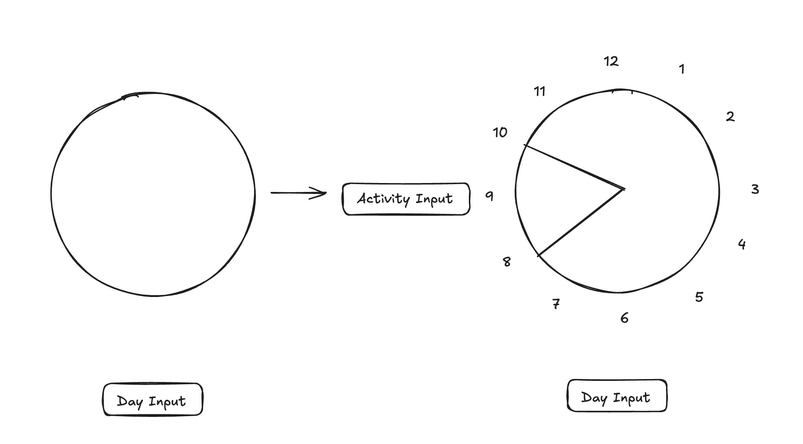

# Day Organization Planner

**Live site:** https://day-organization-planner.vercel.app/

A frontend-only web app for visually planning a day on a circular clock face.
Drag out time segments, label each one with what's planned, and see the whole
day at a glance. Built with React + TypeScript (Vite), no backend.

Most useful for weekends, but works for any day.

## How it works

The day is split into two clock dials:

- **Day dial** — 7:00 AM to 6:00 PM
- **Night dial** — 6:00 PM to 12:00 AM

To plan a segment, click and drag across the dial between the start and end
time you want; the dial snaps to 30-minute increments (with a small tick
mark at each half hour) and shows a live preview of the range as you drag.
On release, a small popup opens next to where you let go asking what's
planned for that block.

Each segment is filled with a random pastel color, with its label rendered in
a darker shade of the same hue so it stays readable against the fill. Segment
labels are shown directly on the dial.

Click an existing segment to reopen its popup, where you can edit the label
or delete the segment entirely.

A **"View all tasks"** button opens a modal listing every segment for the day
in chronological order, independent of which dial it's on.

A **"Download image"** button exports a snapshot of just the two dials as a
PNG file, named `day-planner-YYYY-MM-DD.png`. A **"Clear"** button (with a
confirmation prompt) removes every segment from both dials.

A circular 🕐 button, top-left, toggles a thin red line marking the current
time on whichever dial it falls on (using the browser's local time — no
timezone lookup needed). It's on by default on page load. Between midnight
and 7am, when neither dial is showing that range, the line simply doesn't
appear on either one.

## Day and Week modes

A pill switch, stacked directly below the 🕐 button, toggles between two
planning modes. It always resets to **Day** mode on page load.

- **Day mode** (default) — the behavior described above: a single day's
  segments on the Day/Night dials. A row of info bubbles above the dials
  shows the current date and the time in both Pacific and Eastern time.
- **Week mode** — a row of seven weekday buttons (Sun–Sat) replaces the
  info bubbles; clicking one swaps the dials to that weekday's segments.
  The selected day is highlighted, and entering Week mode always selects
  today's weekday. Each weekday is a recurring template — its plan persists
  indefinitely and is overwritten the next time that weekday is planned,
  independently of the other six days and of Day mode's own plan.
  - **Download image** and **View all tasks** aggregate across all 7
    weekdays (a stacked image with one section per day; a task list
    grouped under weekday headings).
  - **Clear** stays scoped to only the currently selected weekday.

Switching modes, or switching days within Week mode, crossfades the dial
content. The to-do list below is unaffected by mode or day — it's the same
shared list throughout.

## Mobile layout

Below a browser width of 480px (phone-sized), the two dials stack vertically
instead of sitting side by side, each shrinking to fit the screen width, and
the to-do list narrows to match. The pomodoro timer (below) is hidden on
mobile to keep the layout focused.

## To-do list

Below the dials, an always-visible to-do list holds tasks that aren't tied
to a specific hour. Type into the input and hit Enter or **Add** to add a
task.

- **Star** (☆/★) pins one task to the top of the list; starring a new task
  un-stars whichever one was starred before, so at most one is ever pinned.
- **Move up** (↑) reorders a task earlier within its own group (starred
  tasks only reorder among starred, unstarred among unstarred).
- **Done** marks a task complete: its text gets a strikethrough and it
  drops to the bottom of the list, below every active task.
- **Delete** removes a single task.
- **Clear all** (🗑️, with a confirmation prompt) removes every task at once.

The list persists in `localStorage`, so it survives a page reload.

## Pomodoro timer

A 20-minute countdown timer sits fixed in the top-right corner, sized to
match the "Day Planner" title. **Start** begins the countdown (or restarts
it at 20:00 if it had already finished); the button becomes **Pause** while
running, and the display turns green while it's counting down. **Reset**
returns it to 20:00 at any time.

Small ▲/▼ buttons to the left of the countdown adjust it by one minute;
they're disabled while the timer is running so the duration can't drift
mid-block. When the countdown reaches 0:00, the display turns red and a
browser notification fires if notification permission was granted
(requested the first time you click Start).

The timer resets to 20:00 on page reload — it isn't persisted.

## Stack

- React 19 + TypeScript
- Vite (dev server / build)
- Vitest + Testing Library (unit/component tests)

## Getting started

```bash
npm install
npm run dev
```

## Project docs

Design history for each feature lives under `docs/designs/<feature-name>/`
(design rationale, plan, and behavior locks). See `docs/designs/README.md`
for how designs are structured, and `CLAUDE.md` for the working agreement
used when developing this repo with an AI agent.

## Not yet built

These were part of the original concept but aren't implemented yet:

- Multiple days shown side by side
- A calendar view for picking a date to plan



---
init: 7/18/2026
